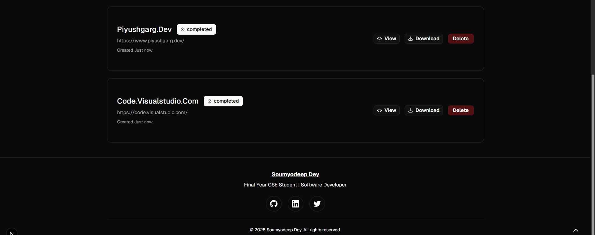
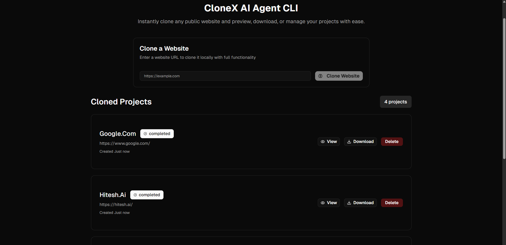
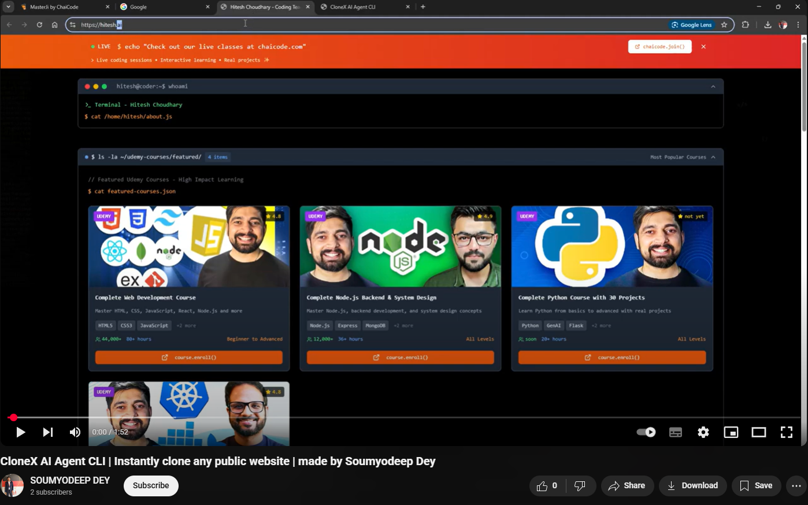

### Clone‑X — AI‑powered website cloner with live “AI thinking”

Clone‑X lets you enter any website URL and locally clone its main page and assets. An AI agent orchestrates the flow (check legal hints → analyze site → clone → validate), and you can watch its live thinking/steps via a streaming UI. Finished clones are previewable in‑app and downloadable as a zip.

### Features
- **Live AI thinking stream**: Real‑time START/THINK/TOOL/OBSERVE/OUTPUT events rendered in the `AIThinking` overlay.
- **One‑click clone**: Enter a URL, watch progress, and get a local copy with `index.html` and `assets/`.
- **Preview + download**: Preview via `/preview/[site]` and download a zip of the cloned folder.
- **Project list**: Persistent list stored in `clones/projects.json` with status updates.

### Tech stack
- **Next.js 15** (App Router), **React 19**, **TypeScript**
- **Tailwind CSS v4**, Radix UI primitives, custom UI components
- **OpenAI** (`gpt-4.1-mini`) for the agent driver
- **Puppeteer** + **Cheerio** for fetching, parsing, and rewriting assets

### Prerequisites
- Node.js 18+ (recommended 20+)
- An OpenAI API key

### Quickstart
1) Install dependencies
```bash
pnpm i
# or npm i / yarn
```

2) Create `.env.local`
```bash
OPENAI_API_KEY=your_key_here
# Optional: If you need to force a local Chrome/Chromium
# PUPPETEER_EXECUTABLE_PATH="C:\\Program Files\\Google\\Chrome\\Application\\chrome.exe"
```

3) Run the dev server
```bash
pnpm dev
# open http://localhost:3000
```

4) In the UI
- Enter a URL like `https://example.com` and click “Clone Website”.
- Watch the AI stream its steps. When complete, use “View” to preview or “Download” to get a zip.

### Screenshots



### Demo
- [](https://youtu.be/N4JuUbHbMgE)
- [Watch the video on YouTube](https://youtu.be/N4JuUbHbMgE)

### How it works (high level)
- The agent driver (`src/agent/driver.ts`) prompts the model to follow a strict sequence and to call tools:
  - `checkLegal(url)` → scans meta/links for advisory compliance hints
  - `analyzeWebsite(url)` → gathers basic page stats with Puppeteer
  - `cloneWebsite(url, outputDir)` → fetches the page, captures assets, rewrites references, saves to `clones/{hostname}`
  - `validateClone(originalUrl, clonePath)` → checks for missing local assets
- The streaming endpoint (`app/api/clone/stream/route.ts`) emits SSE events consumed by `components/ai-thinking.tsx`.
- Preview endpoint (`app/api/preview/[site]/route.ts`) serves rewritten `index.html` resolving `./assets/...` through the static file server.
- Static file server (`app/api/static/[...path]/route.ts`) exposes files under `clones/` and is also mapped via a rewrite in `next.config.mjs`.

Cloned output structure:
```
clones/
  projects.json         # list + statuses
  {hostname}/
    index.html
    assets/
      ...               # css, js, images, fonts captured during clone
```

### API reference (local dev)
- **POST** `/api/clone`
  - Body: `{ "url": "https://example.com" }`
  - Returns: `{ success: boolean, message?: string, error?: string }`

- **POST** `/api/clone/stream` (SSE)
  - Body: `{ "url": "https://example.com" }`
  - Response: `text/event-stream` with `data: {...}\n\n` events. Event shape:
    ```json
    {
      "type": "start" | "thinking" | "complete" | "error",
      "step": "🔄 Iteration" | "🧠 THINK" | "🛠️ TOOL" | "📤 OBSERVE" | "✅ OUTPUT" | "...",
      "content": "string",
      "message": "string",
      "timestamp": "ISO-8601",
      "success": true
    }
    ```

- **GET** `/api/projects`
  - Returns the deduplicated project list from `clones/projects.json`.
- **POST** `/api/projects`
  - Upsert a project entry. Body minimally includes `{ name, url, status }`.
- **DELETE** `/api/projects`
  - Body: `{ id?: string, name?: string }` to remove a project from the list.

- **GET** `/api/preview/{site}`
  - Serves the site’s `index.html` after rewriting `./assets/` → `/api/static/{site}/assets/`.

- **GET** `/api/static/{...path}`
  - Serves files under `clones/` with proper content types.

- **POST** `/api/download`
  - Body: `{ "site": "{hostname}" }`
  - Returns a zip stream of `clones/{hostname}`.

- **POST** `/api/delete-folder`
  - Body: `{ "folderName": "{hostname}" }`
  - Recursively removes the folder under `clones/`.

### Notes and limitations
- The cloner targets the landing page and referenced assets captured during a single page load; dynamic navigation/app logic is not reconstructed.
- Paths are rewritten to local `./assets/...` and served via `/api/static/...` during preview.
- The legal check is advisory only for learning purposes; you are responsible for compliance when cloning third‑party content.

### Troubleshooting
- Puppeteer fails to launch Chromium
  - Ensure Node 18+, reinstall deps (`pnpm i`), or set `PUPPETEER_EXECUTABLE_PATH` to a local Chrome.
- Missing `OPENAI_API_KEY`
  - Create `.env.local` with your API key and restart the dev server.
- Nothing shows in Preview
  - Check that `clones/{hostname}/index.html` exists; see server logs for missing assets.

### Scripts
```bash
pnpm dev     # start dev server
pnpm build   # build
pnpm start   # run production build
pnpm lint    # lint (builds ignore lint/type errors per next.config.mjs)
```

### Key files
- `app/page.tsx` — dashboard UI (input, projects, actions, AI overlay)
- `components/ai-thinking.tsx` — SSE client that renders AI steps
- `app/api/clone/stream/route.ts` — SSE clone runner
- `src/agent/driver.ts` — agent driver that enforces tool calling
- `src/agent/tools/*` — cloning tools (Puppeteer/Cheerio)
- `src/cloner/core.ts` — asset saving and path rewriting helpers
- `app/api/preview/[site]/route.ts` — preview rewritten HTML
- `app/api/static/[...path]/route.ts` — serve files from `clones/`

### License
For educational use only. Verify you have rights to copy any site you clone.
